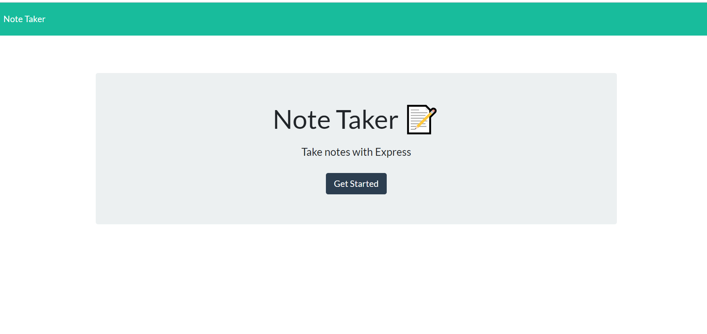
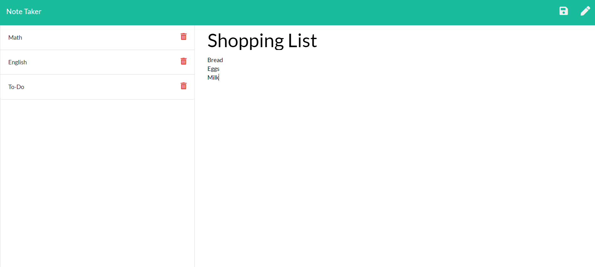

# Team-Template-Generator
## Description
  ---
  This is a note taking application that uses a server and utilizes an Express backend that saves and retrieves data from a JSON file.
  
  Inside this application routes were used to ensure correct navigation and to read and create new files.

  ## Table of Contents 
  --- 
  [Application](#application)

  [Usage](#usage)
  
  [Questions](#Questions)

  ## Application
  ---
  * Home page of application
  
  

  * Note Taking portion of application
  
  
  
  ## Usage
  ---
  * After the user has clicked get started they the page will load with saved notes on the left side and a new note on the right.
  * The user will then be able to add a new title and content to a note. Once the user is finished they can press the save button in the top right corner and the not will be added to the left hand-side
  * User will be able to click between past saved notes and read them. 
  * If the trash can icon is clicked it will delete the corresponding note.
  * If the user wishes to create a new note then simply click the pencil icon.

  ## Questions
  ---
  To reach me with additional questions please contact me with one of the following below.
  * My github profile - [Github Link](https://github.com/Lorena-Ramirez)
  * Email - <ramirezlorenaa18@gmail.com>

